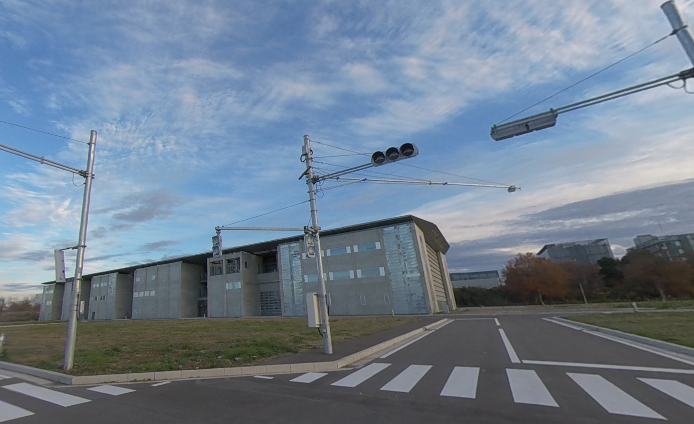
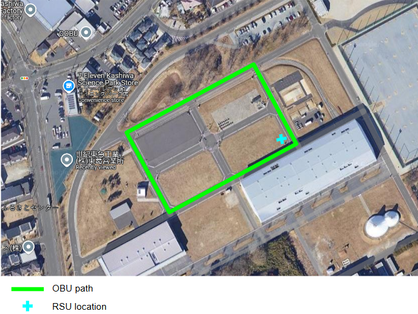

# Datasets

For research purposes, an actual experiment was conducted in the Kashiwa campus area of the University of Tokyo in January 2023.

We have gathered the generated data in form of ROSBAG and PCAP files.

A ROSBAG file is a file format used in the Robot Operating System 2 (ROS2) for recording and playing back data. This data includes messages that are published over ROS2 topics during the operation of a ROS2 system. The ROSBAG file format is an evolution of the original ROSBAG file format used in ROS1. It is designed to provide a more efficient and flexible way to store and replay ROS2 data. The ROSBAG file format is binary, which allows it to efficiently store large amounts of data. It can record all types of ROS2 messages, including sensor data, status messages, and more. This makes it a valuable tool for debugging and analysis in ROS2 systems. In addition to recording and playback, ROSBAG files can also be used for data exchange between different ROS2 systems, making them a versatile tool in the ROS2 ecosystem.

PCAP (Packet Capture) is a file format used to capture network traffic. These files store data as it is transmitted over a network and are commonly used in the field of network security, network troubleshooting, and network protocol development. A PCAP file contains an accurate record of network activities. It includes the exact packets that pass through a network, including their source, destination, and payload. This makes it possible to replay and analyze the network traffic in detail. Tools like Wireshark, tcpdump, and many others can read PCAP files and provide a detailed view of the network traffic.

There was one RSU and one OBU involved in the experiment. the OBU makes several rounds around the Kashiwa campus streets. Meanwhile, the RSU is constantly monitoring the environment for any objects and broadcasting the prediction data over the DSRC network and the OBU is both receiving RSU's predictions and making its own by processing its sensors' data.

We have already provided this data in the project's repository under the name of `sample_data/kashiwa_exp_202301`. Use the [AVVV configuration page](../how_to_guides/configuring_application) to run an analysis followed by visualisation on this data.
