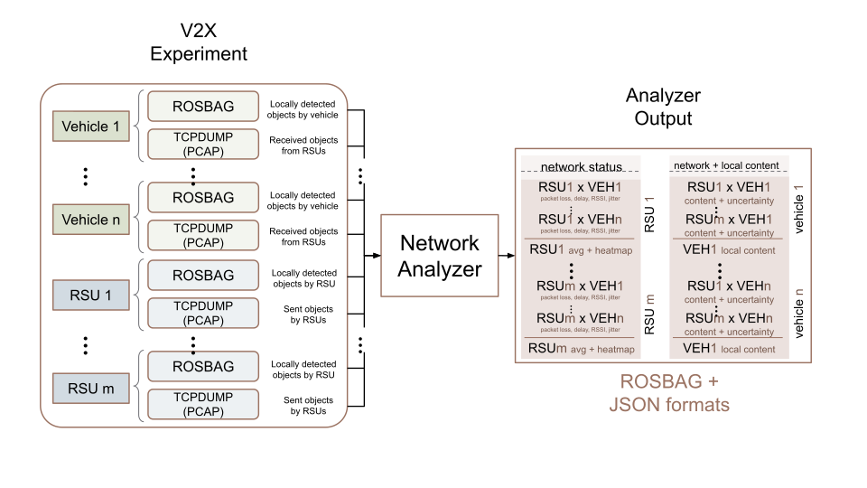
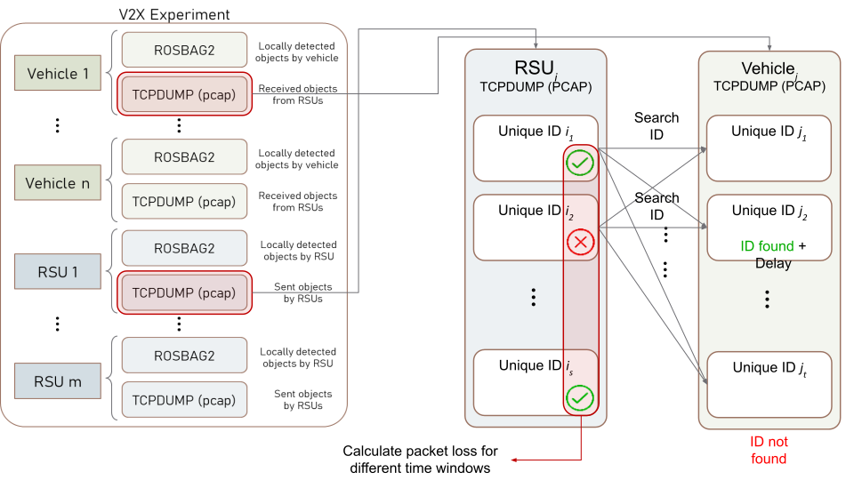
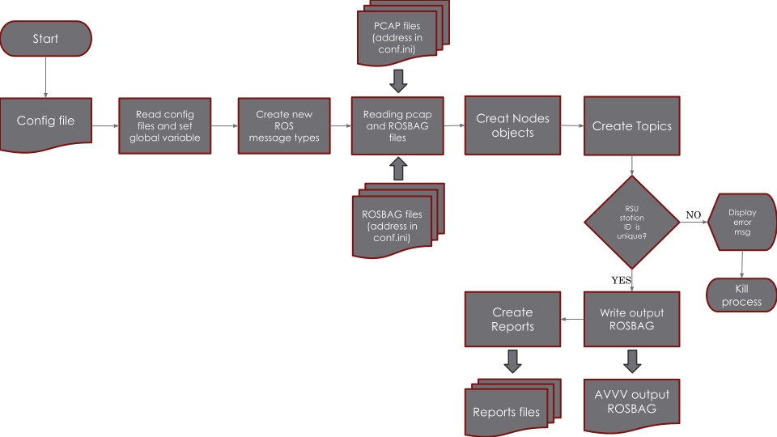

# Analyser Design

This section will explain the design and the concepts of the Analyser module. The input section describes the input of this module and their requirements. The output section will give a detailed explanation of the output this module generates. Lastly, The architecture section will dissect the Analyser's body and go through its functional components.

## Analyser Input

The Analyser module's input consists of two types of data for each RSU or OBU; a PCAP file having captured the sent or received packets, and a ROS2 Bag file including each unit's local messages exchanged between local ROS2 nodes.

### PCAP Files

PCAP is an API used to capture network data packets. Many other programmes such as Wireshark and TCPDUMP capture network and create such files. Current AVVV is only compatible with the [ETSI TS 103 324 V2.1.1 (2023-06)](https://www.etsi.org/deliver/etsi_ts/103300_103399/103324/02.01.01_60/ts_103324v020101p.pdf) standard and the [CPM](../../protocols/cpm_protocol) protocol.

### ROS2 Bag Files

`ros2 bag` is a command line tool for recording data published on topics in your system. It accumulates the data passed on any number of topics and saves it in a database. You can then replay the data to reproduce the results of your tests and experiments. Recording topics is also a great way to share your work and allow others to recreate it. The output of this command is a Bag file. We're going to record our experiments topics and use the recordings in our analysis. For more details see the [prepare-input](../../how_to_guides/preparing_input) page.

## Analyser Output

The output the analyser produces is a set of various information in form of different files for various purposes. Below is a list of them.

### Universal ROS2 Bag File

The main output of the Analyser is a single Bag file containing all the predictions, movements and network status for all Units and all RSU-OBU pairs. This file is used later in the Visualiser module to visualise what has happened during the experiment. The Bag file will contain the following topics:

- RSU:
    - `/RSU_#/tf`: RSU location (tf2_msgs/msg/TFMessage)
    - `/RSU_#/detected_objects`: RSU prediction data (autoware_auto_perception_msgs/msg/PredictedObjects)
    - `/RSU_#/cpm`: RSU prediction data broadcast in the CPM format (cpm_ros_msgs/msg/CPMMessage)
- OBU:
    - `/OBU_#/tf`: OBU location (tf2_msgs/msg/TFMessage)
    - `/OBU_#/detected_objects`: OBU prediction data (autoware_auto_perception_msgs/msg/PredictedObjects)
    - `/OBU_#/RSU_#/cpmn`: RSU prediction data broadcast in the format of CPM received by an OBU along with the instantaneous network status of the packet. (cpm_ros_msgs/msg/CPMN)
    - `/OBU_#/RSU_#/network_status`: Average network status over some period of time (typically 1 second) (cpm_ros_msgs/msg/NetworkStatus)

### Instantaneous Network Status

The analyser will provide the results of its computation of delay, jitter, packet loss and RSSI per packet. Such results are available as graphs, animations and images for all RSUs (averaged across all OBUs) and all OBU-RSU pairs.

### Average Network Status

The analyser will also provide the results of its computation of delay, jitter, packet loss and RSSI averaged based on positional grids or time slots. Such results are available in form of heatmap files, graphs and images for all RSUs (averaged across all OBUs) and all OBU-RSU pairs.

## Architecture and Inner Workings

### Structure

The analyser module is made up the following modules and interfaces:

- A config module
- A PCAP interface
- A ROS2 interface
- Main module

#### Config Module

The config module loads a `config.ini` file and configures the analyser accordingly.

#### PCAP Interface

The PCAP interface mainly works with [Pyshark](https://pypi.org/project/pyshark/) a Python wrapper of [Tshark](https://tshark.dev/). Since, the official Tshark has not updated to the last version of ETSI, we use a modified version of Tshark. The PCAP interface provides ways to read and write PCAP files and their data.

#### ROS2 Interface

The ROS2 interface uses [rosbags](https://pypi.org/project/rosbags/), a Python package that handles ROS2 messages removing the need for the ROS2 stack to be available. This interface provides means to read and write ROS2 messages and Bag files.

#### Main Module

The main module of Analyser consists of algorithms to read both PCAP and Bag files, process them and derive a variety of network characteristics between RSUs and OBUs.

### Inner Workings

The Analyser will read all the input files, process their packets and produce the network analysis for all units and all RSU-OBU pairs.

It will calculate packet loss and delay (jitter and RSSI data are not available yet). For packet loss, each RSU packet is searched among the packets received by OBU, if not present a packet loss value of 1 is assigned. If not lost, the broadcast time by RSU and the receive time by OBU is calculated for delay.

The following figure displays a flowchart of the Analyser processes.

