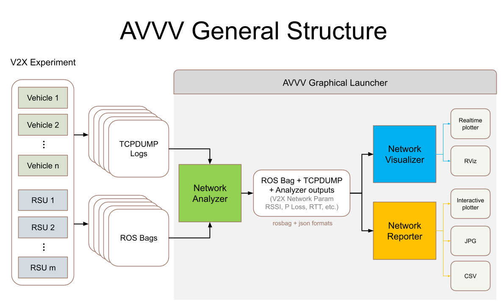

# AVVV's Design

AVVV consists of three main modules of Analyser, Visualiser and Reporter. Each module, properly integrated with others, has a set of responsibilities to process data for the purposes of the application.

The Analyser module will generate network parameters of the involved RSUs and OBUs such as delay, jitter, packet loss and RSSI recorded during experiments in the format of TCP dumps.

The Visualiser's mission is, as the name suggests, to visualise the experiments along with their network communication contents and status.

Finally, the Reporter module will display the results of the network analysis either as overall and grid-based heatmaps or detailed and instantaneous graphs.

Read more about each module:

- [Analyser](analyser_design)
- [Visualiser](visualiser_design)
- [Reporter]()