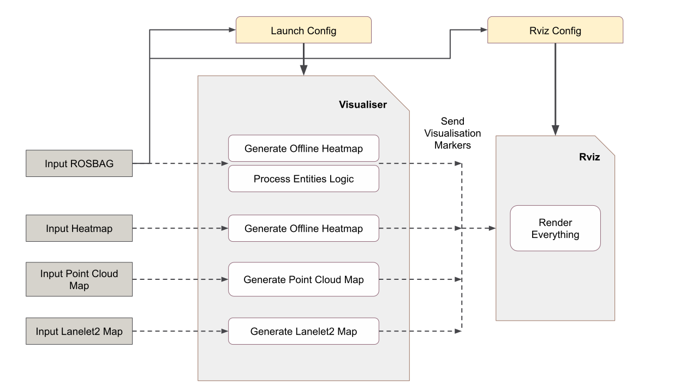
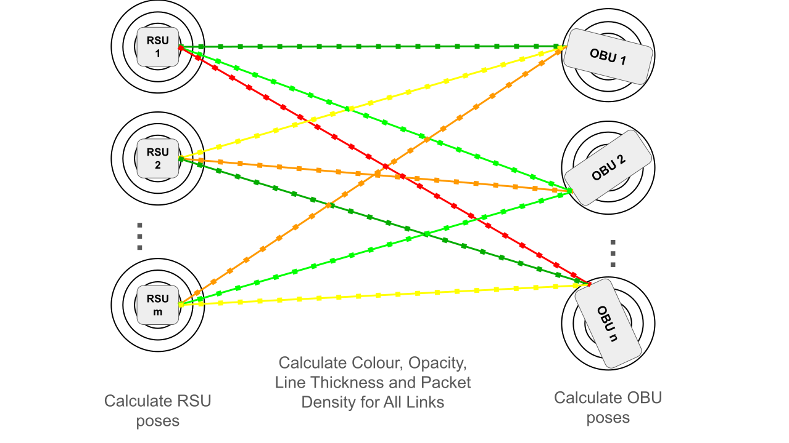

# Visualiser Design

The Visualiser module consist of multiple packages to display various items and illustrate key features and events during the experiments.
This section demonstrates the concepts of the Visualiser module. The input section describes the input of this module and their requirements. The output section will give a detailed explanation of the output this module generates. Finally, The architecture section will dismantle the components of the Visualiser.

## Visualiser Input

The visualiser module takes in multiple input sources. A compulsory ROSBAG file containing the experiments data along with optional heatmap for any of the network status characteristics, point cloud map and lanelet2 map displaying the map of the experiment location for better visualisation.

### ROS2 Bag

The Visualiser receives a [ROS2 Bag](https://docs.ros.org/en/humble/Tutorials/Beginner-CLI-Tools/Recording-And-Playing-Back-Data/Recording-And-Playing-Back-Data.html) file containing all the information about the conducted experiment. This file should have already been generated by [Analyser](../analyser_design). When the Bag file is played back, the experiment's event's are recreated and displayed to the user. The Bag file must contain the following topics:

- RSU:
    - /RSU_#/tf: RSU location (tf2_msgs/msg/TFMessage)
    - /RSU_#/detected_objects: RSU prediction data (autoware_auto_perception_msgs/msg/PredictedObjects)
    - /RSU_#/cpm: RSU prediction data broadcast in the CPM format (cpm_ros_msgs/msg/CPMMessage)
- OBU:
    - /OBU_#/tf: OBU location (tf2_msgs/msg/TFMessage)
    - /OBU_#/detected_objects: OBU prediction data (autoware_auto_perception_msgs/msg/PredictedObjects)
    - /OBU_#/RSU_#/cpmn: RSU prediction data broadcast in the format of CPM received by an OBU along with the instantaneous network of the packet. (cpm_ros_msgs/msg/CPMN)
    - /OBU_#/RSU_#/network_status: Average network status over some period of time (typically 1 second) (cpm_ros_msgs/msg/NetworkStatus)

### Heatmap

A heatmap, or heat map, is a powerful data visualization tool that provides a visual representation of data values in a matrix. It uses colors to represent the magnitude of a variable, making it easier to understand complex patterns and trends within the data. They offer a simple and intuitive way to convey information, making them valuable tools for both experts and non-experts. Visualiser receives an optional CSV file containing information about the network fields in the XY space. Then, it produces the resulting heatmap diagram to the user.

### Point Cloud Map

A point cloud is a discrete set of data points in space. The points may represent a 3D shape or object. Each point position has its set of Cartesian coordinates (X, Y, Z). Points may contain data other than position such as RGB colors, normals, timestamps, intensity and others. Point clouds are generally produced by 3D scanners or by photogrammetry software, which measure many points on the external surfaces of objects around them. For our case, a point cloud map is generated using a 3D Lidar from the experiment space. The user can provide this data to the Visualiser module in a single PCD file.

### Lanelet2 Map

A lanelet2 map is a high-definition map holding information about many traffic items such as roads, off-road passable area, pedestrian area, traffic signals, as well as traffic rules applying to each one. The user can optionally provide this map to the Visualiser module via a single OSM file.

!!! warning
    The point cloud and lanelet2 maps should match regarding geographical locations, scales and directions for best visualisation results.

## Visualiser Output

Visualiser uses [RViz](https://docs.ros.org/en/humble/Tutorials/Intermediate/RViz/RViz-User-Guide/RViz-User-Guide.html) to render the 3D objects for the visualisation purposes. And for this purpose, RViz uses [Visualisation Markers](https://docs.ros.org/en/humble/p/visualization_msgs/interfaces/msg/Marker.html). Therefore the output of our module is a constant generation of such visualisation marker messages that display the various items in RViz.

## Architecture and Inner Workings

### Structure

Visualiser is made up of multiple packages and components:

- Launch
- Point Cloud
- Lanelet2
- Offline Heatmap
- Main
    - Entity Logic Processor
    - Online Heatmap Processor

#### Launch

The Launch component loads and runs a `visualiser.launch.py` file which is a [ROS2 launch file](https://docs.ros.org/en/humble/Tutorials/Intermediate/Launch/Launch-Main.html). This file contains application configurations and runs other components of the Visualiser module.

!!! info
    The user doesn't need to manually alter the config file. We've provided a UI Launcher application that does all the hard work.

#### Point Cloud

The Point Cloud component loads a given PCD file into RViz.

#### Lanelet2

The Lanelet2 packages loads a given OSM file into RViz.

#### Offline Heatmap

The offline Heatmap component loads a heatmap-related CSV file and displays it in RViz.

#### Main

The main component processes the input ROSBAG file and recreates the experiments.

### Inner Workings

The following figure shows the Visualiser components and their relations. As can be seen in the figure, a launch config file is present that configures the module. It determines what components to launch and how to run the module. This file itself is configured using the input ROSBAG file and the user's needs.

After launch, the summoned components start generating the output each from its input.

Upon running the module, RViz is also launched to display the visualisation messages. RViz takes in a config file that is also automatically configured from the input ROSBAG and user's needs, similar to the launch config file.

The following figure describes the Main component's Entity Logic Processor. This component's mission is to process the input ROSBAG messages for visualisation of the RSU's, OBU's and their communications.

