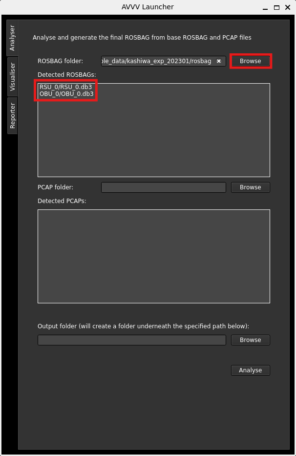
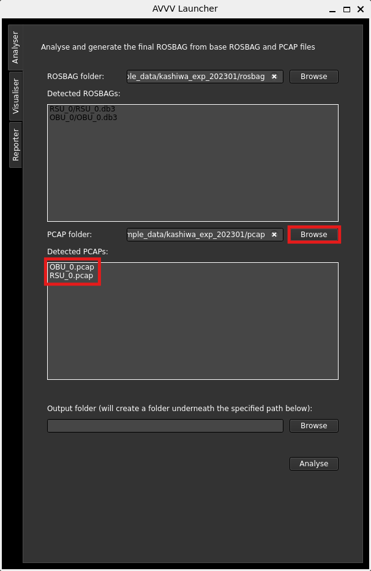
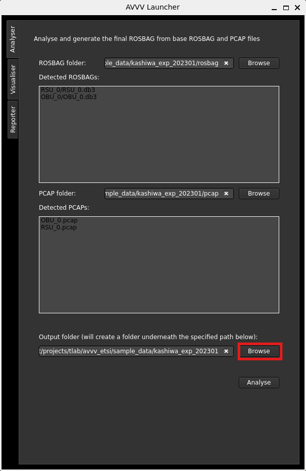
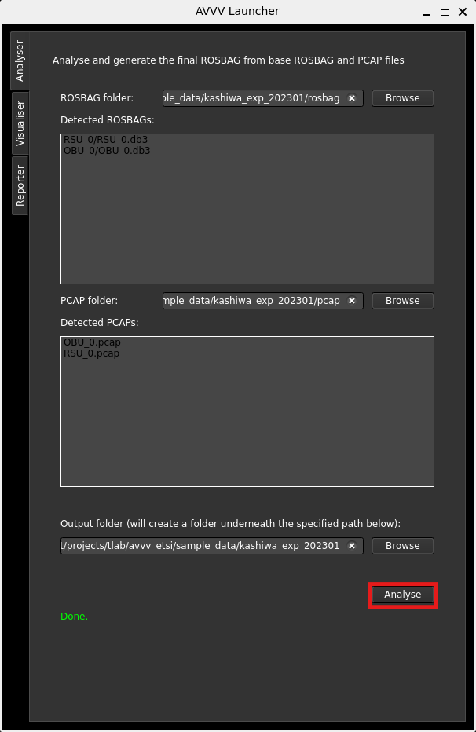

# Configure analyser

After launching the UI, the first stage is running the analyser. To run the analyser on your input data, after [preparing the input data](../../preparing_input/index.md), follow the below steps:

- On the "Analyser" tab, first fill the ROSBAGs directory in the Analyser tab. To do so, click on the browse button in the ROSBAG section and locate the root `rosbag` folder where all RSU and OBU ROSBAG folders reside (you can try with the sample data provided). After selecting the path, a list of all ROSBAG files with their relative paths will appear in the panel.

- Then fill in `pcap` directory. Similarly, click on browse in the PCAP section and locate the folder where the PCAP files exist. After choosing the right location, a list of all PCAP files will turn up in the panel.

- Click on the browse button in the output section. Select a folder where you want your output files generate. The application will create another folder named "output" under the directory you select.

- Finally, to run the Analyser with your data. Wait till the application finishes. This will generate a single ROSBAG file along with all the graphs and report files.

If anything went wrong, please consult the [troubleshooting page](../../../support/troubleshooting.md).
