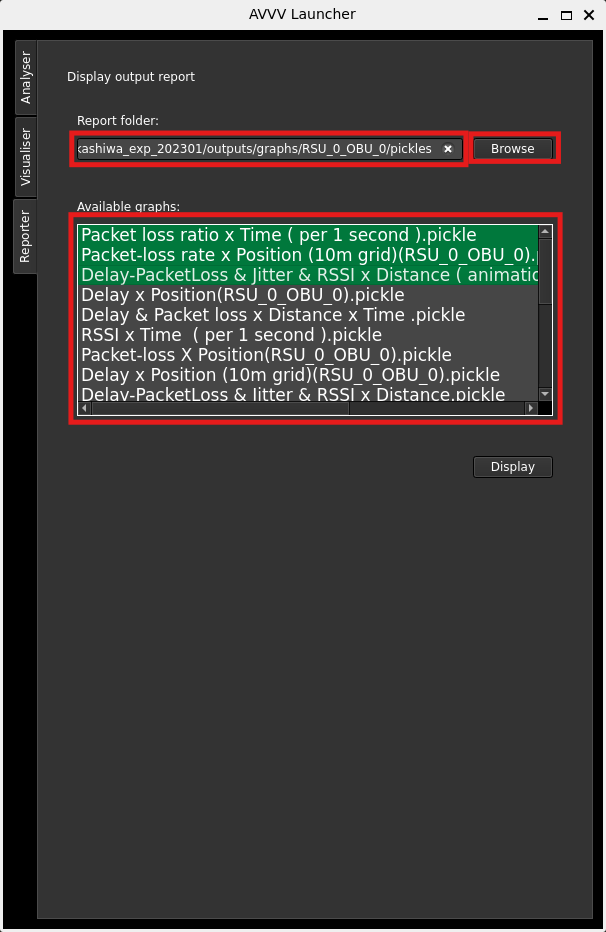
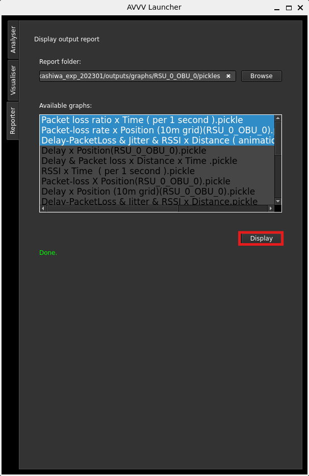
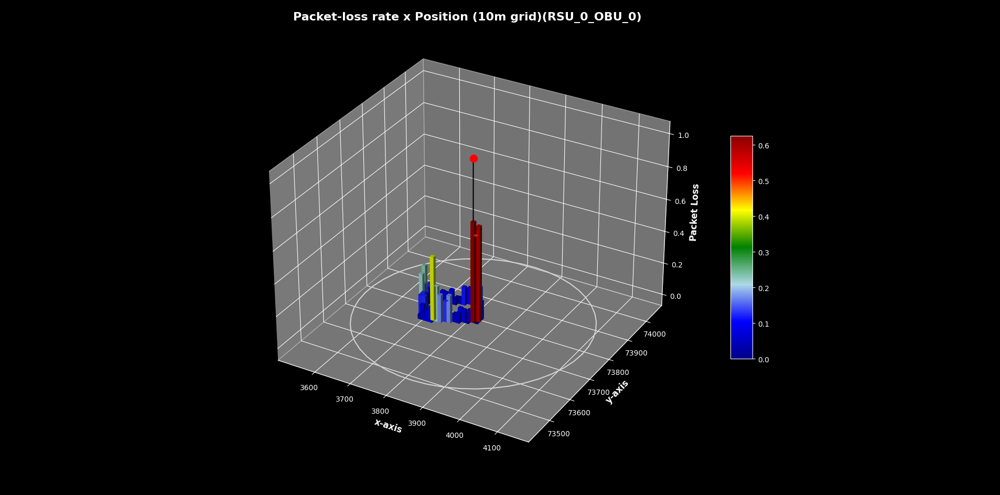

# Configure reporter

The reporter tab is responsible to display generated pickle graphs by Analyser. To view these reports, after Analyser has processed the input and generated the graphs, click on browse and locate the generated `outputs` folder. Then locate `graphs` and then your desired RSU, OBU or RSU-OBU pair directory. Then locate `pickles` and select choose.

Out of the list of graphs shown on the tab, select as many as you want.

Clicking on display should bring up their graphs. Note that the 3D graphs are interactive.

