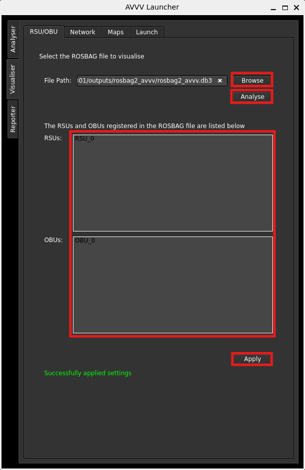
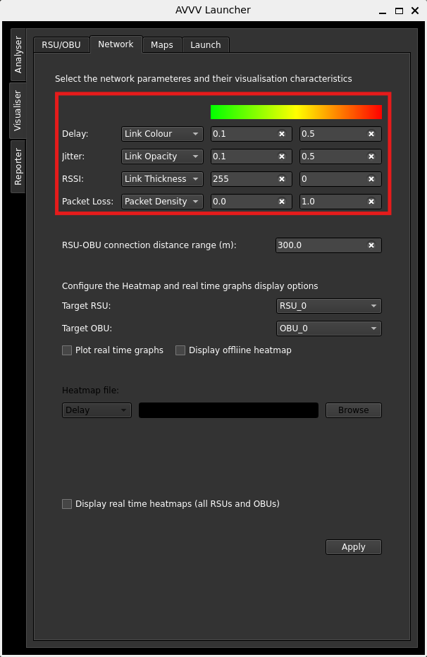
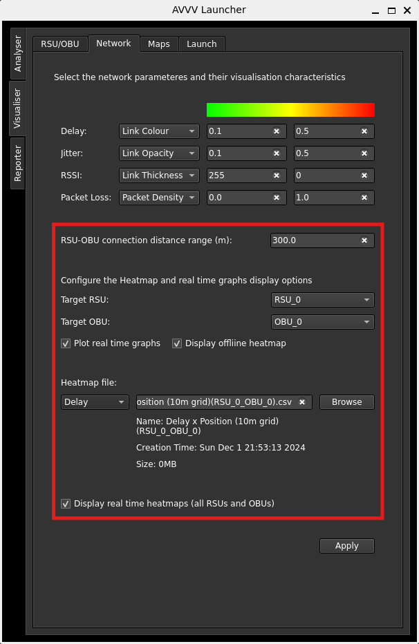
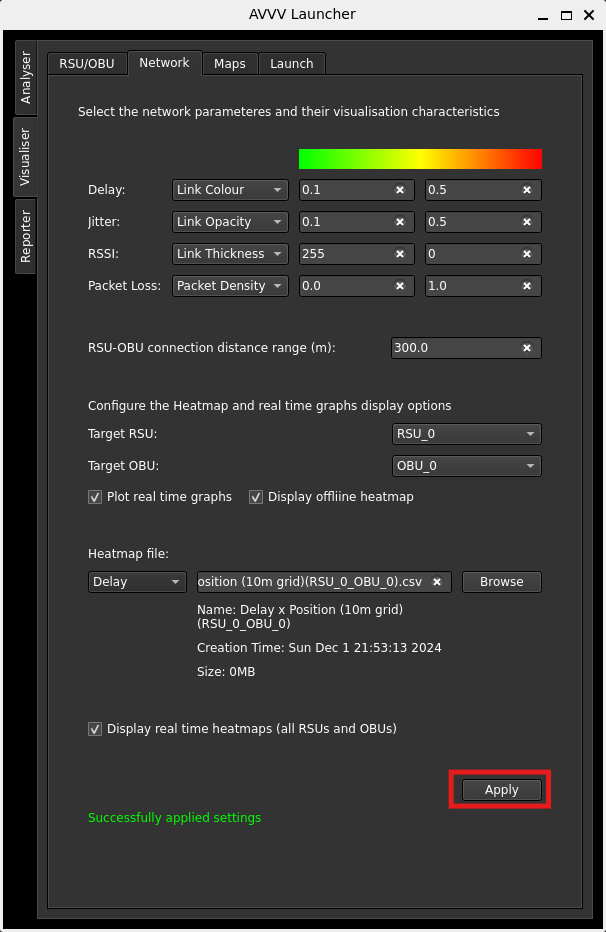
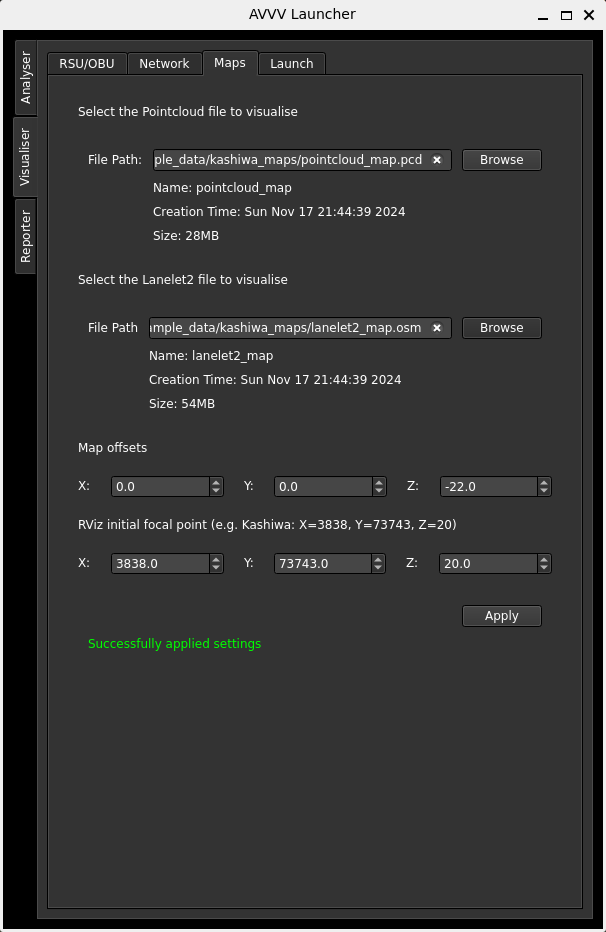
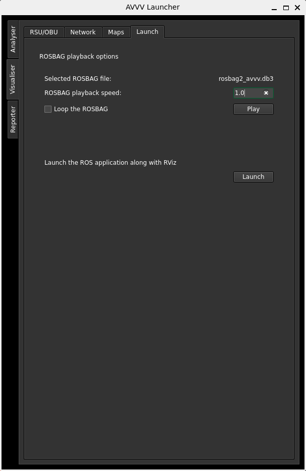
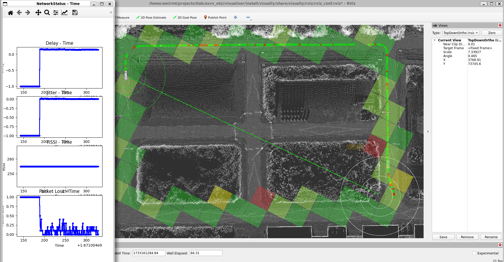

# Configure visualiser

Visualiser will display the results of the analysis in a 3D environment simulating the OBUs, RSUs and their communication qualities.

## ROSBAG File Selection

If you ran the analyser immediately before this stage, the Visualiser's first tab, namely "RSU/OBU", will automatically fill in the ROSBAG file it needs. Otherwise, if it's not filled, click on "Browse" and locate the generated ROSBAG by the Analyser, then click on "Analyse" below "Browse". This step will display the IDs of the OBUs and RSUs within the ROSBAG file. Don't forget to click on "Apply" at the bottom of the tab.

    

## Network Visualisation Configuration

In the Network tab, you can configure how the network will show up in the visualiser app. You can, for example, configure the RSU-OBU delay be visualised by link-colour in the visualiser and then select each colour to represent what value.

    

You can configure the connection range of the RSU-OBU pairs. You can select to display real time graphs of the network characteristics by checking the box.

Also you are able to check the offline heatmap box and select the offline heatmap, generated by Analyser, to display in Visualiser. This file is located under the `csv` folder of the generated `output` directory. The heatmap files contain information about their grid size in their names.

Lastly, you can check the online heatmap box to display the real time heatmaps of all network attributes for the selected RSU-OBU pair.

    

Don't forget to click "Apply" after changing the settings.

    

In "Maps", you are able to select Lanelet2 and/or Point Cloud maps with an arbitrary offset to show up in Visualiser with location adjustments. Also, the initial focal point of the RViz is modifiable via the provided fields in this tab.

    

In the last tab, "Launch", you can launch the visualiser app and play the selected ROSBAG and view the results in Visualiser. Some options are provided for playing the ROSBAG.

    

Launching the application and playing the ROSBAG file should replay the experiments without problems.

    

If anything went wrong, please consult the [troubleshooting page](../../../support/troubleshooting.md).

