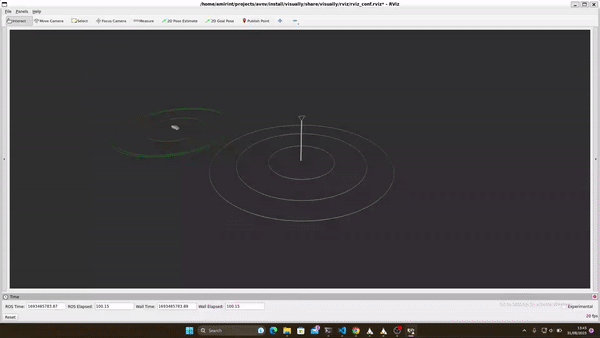
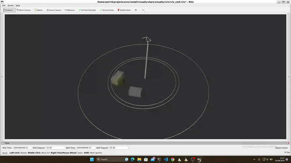
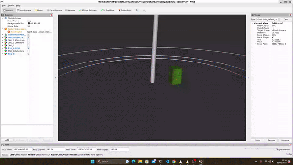
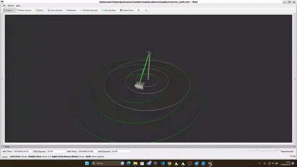
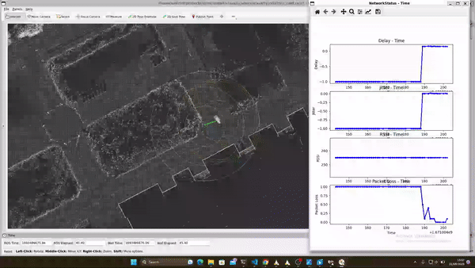
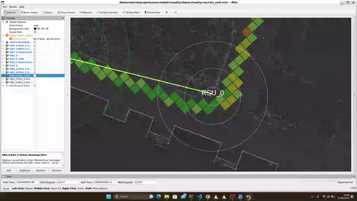
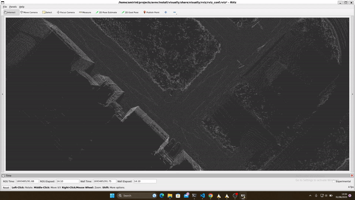

# Autonomous Vehicle Network Visualisation

This package provides a tool to visualise the experiments done on cooperative autonomous vehicles. It includes many key components involved in the field such as RSUs and Cloud mediators. The package also contains the key network concepts such as delay, jitter, RSSI and packet loss. We use ROS2 humble's RViz for the visualisation purposes.

## Features

- Visualisation of the accurate pose of the RSUs and OBUs


- Visualisation of the detected objects


- Visualisation of the detected objects transmitted over RSU-OBU network


- Visualisation of different network parameters status using various features


- Visualisation of the network status graphs and statistics as the visualisation goes by


- Visualisation of the offline and real time heatmaps


- Visualisation of point cloud data depicting the pre-gathered map or the real time sensors view


## Dependencies

### ROS dependency

- [ROS2 humble](https://docs.ros.org/en/humble/)

### Manageable using `rosdep`

You can resolve the following dependencies using [`rosdep`](https://docs.ros.org/en/humble/Tutorials/Intermediate/Rosdep.html). Simply navigate to the root of your workspace and run ```rosdep install --from-paths src/visually -y --ignore-src```.
- [rviz_visual_tools](https://github.com/PickNikRobotics/rviz_visual_tools)
- [PCL](https://pointclouds.org/)
- [GeographicLib](https://geographiclib.sourceforge.io/C++/doc/install.html#cmake)

### Manual

You need to manually clone the following package beside `visually`.
- [autoware_auto_msgs](https://github.com/tier4/autoware_auto_msgs)
- [cpm_ros_msgs](https://github.com/AmirInt/cpm_ros_msgs)
- [visplot](https://github.com/AmirInt/visplot)

## Build

- Clone the repository into your ROS2 workspace:
```console
git clone git@github.com:AmirInt/visually.git
```
- Source your ROS2 Humble:
```console
source /opt/ros/humble/setup.bash
```
- From the root of your workspace, use `colcon` to build the package:
```console
colcon build --packages-select visually
```

## Run

This package can be used as a standalone application but you need to set parameters in the launch file manually. We recommend using [visually_launcher]() to set the parameters automatically and ease the launch of the application.

- From the root of your workspace, source your ROS2 workspace:
```console
. install/setup.bash
```
- Launch the application:
```console
ros2 launch visually visualiser.launch.py
```
